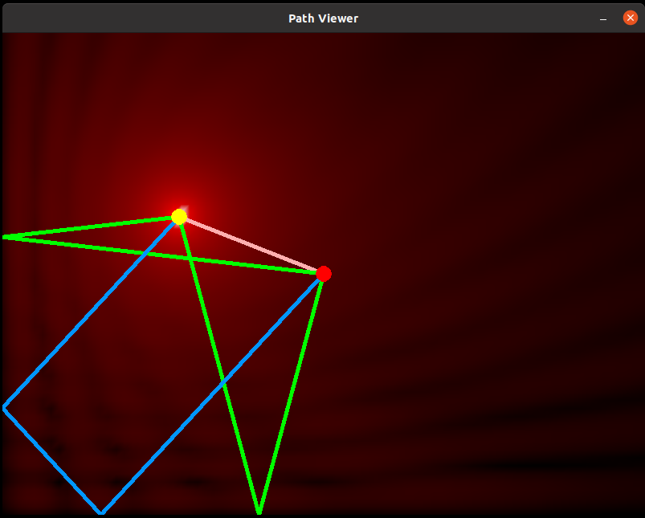

# coms4105-sim
This is a fun little program that calculates the possible paths from a receiver
to a transmitter, with 'walls' on the left and bottom edges of the screen.

You can grab the transmitter and receiver and move them around.

The background is highlighted according to the strength of the signal from the
transmitter at each point on the screen. This takes path length delays as well
as constructive and destructive interference into account.

Made to help visualise things in a course named coms4105.

There's some issues with lag when you move the mouse really slowly, and I think
this is because it does an unnecessarily large amount of updates since there are 
mouse movement events for every pixel. I could try to fix it, but there's no point.

## Building
You need SDL2. On Linux the package `libsdl2-dev` will probably be available
from your package manager.

For Mac and Windows, have a look at the SDL website (libsdl.org) to see what
you need to do to install it for development (you need the compiler to have
access to the necessary header files and libraries). You may have to modify
the compile command or library names when compiling on these other systems.
This library is pretty popular so there'll be bajillions of tutorials on how
exactly to do this for whatever your system is.

## Screenshot

